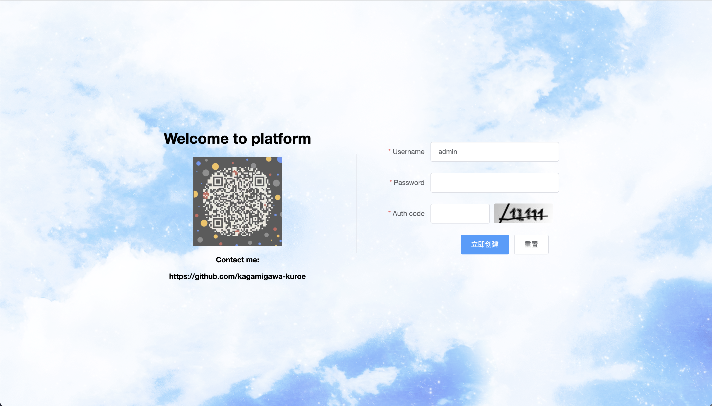
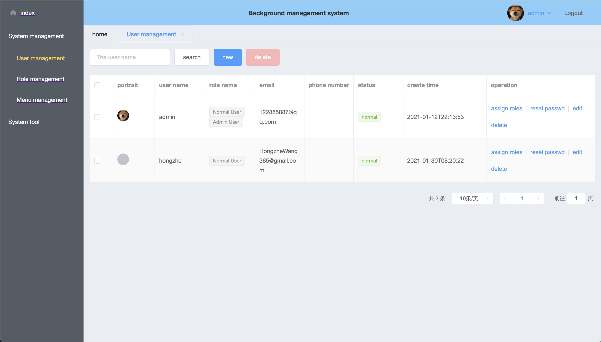
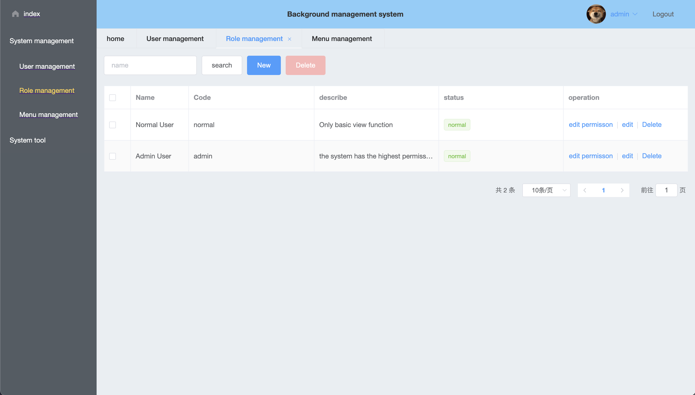

# User-Management-platform
#### Interface

---

> A user management platform by front end in framework **vue** and back end in **java springboot**. ( Front end separation )
>
> Here are some web interfaces: 
>
> 
>
> 
>
> 

#### Technology Stack

---

Front end :

- [x] Vue
- [x] Vue-router
- [x] library Element-UI
- [x] Axios 
- [x] Mock

---

Back end : 

- [x] Java
- [x] Spring/Spring Boot
- [x] Spring Security
- [x] Mysql
- [x] Redis
- [ ] MongoDb ( work-in-progress for storing image)
- [x] Mybatis/Mybatis Plus

---

#### Main functions

